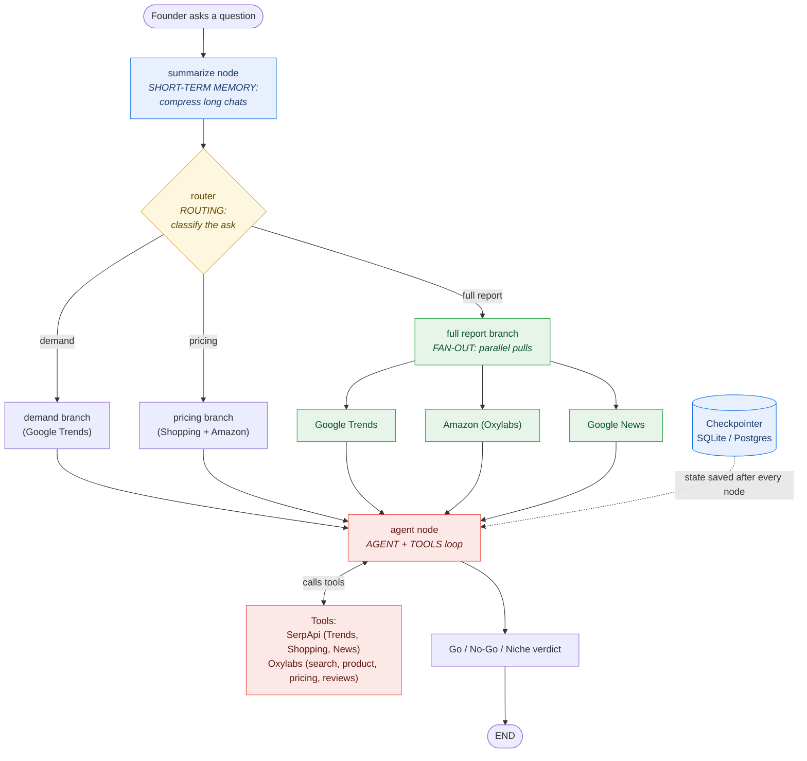

# Assignment 3 - Build **LaunchLens**: A Market-Intelligence Agent

**Course:** LangGraph for Production AI Agents
**Type:** Startup POC (Proof of Concept) - individual or pairs
**Released:** 14 June 2026
**Due:** **28 June 2026, EOD (11:59 PM)**
**Weight:** 100 marks (+ up to 10 bonus)

> ### 🌐 Landing page: **https://fnusatvik07.github.io/agentbuilder-assignment3/**
> The full brief with the embedded video and tabs (Problem · Build · Architecture · Data · Grading · Submit). Start there.
>
> **▶ Watch the 60-second brief:** on the [landing page](https://fnusatvik07.github.io/agentbuilder-assignment3/), the [Releases page](https://github.com/fnusatvik07/agentbuilder-assignment3/releases/tag/v1.0), or [download `LaunchLens-brief.mp4`](./docs/LaunchLens-brief.mp4).

---

## 1. The Scenario

You are the founding engineer of a startup. Here is the pitch your founder walks in with:

> *"E-commerce sellers and founders are flying blind. **Demand** data lives on Google - what people search for, what's trending, what it costs across the web. **Supply** data lives on the marketplaces - what's actually selling on Amazon, at what price, with what complaints in the reviews. Nobody connects the two. We're building **LaunchLens**: an AI agent that fuses both and tells a founder whether a product is worth launching, how to price it, and how to position it."*

Your job is to build **LaunchLens** from scratch as a standalone product.

> **This is a fixed brief, not an open-ended hackathon.** Everyone builds the same product (LaunchLens) so we grade *engineering*, not who had the cleverest idea. Your creativity goes into *how well you build it* - the graph design, the data fusion, the code quality, the presentation.

---

## ✅ In plain terms: exactly what to build and submit

Read this part first. The rest of the document is the detailed version of these same bullets.

**What you are building (one line):** a command-line chat agent called **LaunchLens**. A founder types a product idea, your agent researches it live, and replies with a **Go / No-Go / Niche** verdict, then keeps chatting with memory of the conversation.

### A. Your agent must do all of these
- [ ] Take a founder's product question in plain English, in a **CLI chat loop**.
- [ ] Pull **demand** data from **SerpApi** (use at least **2** of: Google Trends, Google Shopping, Google News, Google Search).
- [ ] Pull **supply** data from **Oxylabs** (use at least **2** of: `amazon_search`, `amazon_product`, `amazon_pricing`, `amazon_bestsellers`, reviews).
- [ ] **Fuse both sides** in the agent's reasoning - one combined answer, not two separate features.
- [ ] Output a clear **Go / No-Go / Niche** verdict covering demand, price band, and positioning.
- [ ] **Remember the conversation** across turns, and **summarize** it once it gets long.

### B. Your LangGraph graph must contain all 5 (this is 45 of 100 marks)
- [ ] **Graph + state** - a typed `StateGraph` with clean `START -> ... -> END` wiring.
- [ ] **Routing** - conditional edges that pick a path based on the user's intent.
- [ ] **Fan-out** - parallel nodes that run at the same time, then merge their results.
- [ ] **Agent node + tools** - an LLM agent with SerpApi and Oxylabs wrapped as tools.
- [ ] **Short-term memory** - a checkpointer **plus** a summarization node.

### C. What to submit (one public GitHub repo, by 28 June EOD)
- [ ] **Working code** that runs from your README (CLI is enough).
- [ ] **README** with: setup steps, a **concept map** (file + function + line for each of the 5 concepts above), and 3-6 demo prompts.
- [ ] **`.env.example`** listing required keys (never commit real keys).
- [ ] A **graph diagram** (drawn, ASCII, or `graph.get_graph().draw_mermaid()`).
- [ ] **Slides** (PDF / PPT / Google Slides) explaining the product and architecture.
- [ ] A **2-minute screen-recorded demo video** that explains LaunchLens and shows it running, including memory across turns.
- [ ] **`SUBMISSION.md`** - copy [`SUBMISSION_TEMPLATE.md`](./SUBMISSION_TEMPLATE.md), fill it in.

**How to hand in:** reply on the assignment thread with your public repo link before **28 June 2026, 11:59 PM**.

> If you can tick every box above, you have done the assignment. Everything below is detail and examples.

---

## 2. The Product You Will Build - **LaunchLens** 🔭

**LaunchLens** is a conversational LangGraph agent (CLI is enough; UI/API is bonus) that a founder talks to like this:

> *"I want to launch a stainless-steel insulated water bottle in India under ₹1,500 - is it worth it, and how should I position it?"*

LaunchLens must be able to answer questions like that by doing the following, and the founder must be able to **keep the conversation going** ("what about the US market?", "compare it with the cheaper one") with full memory of earlier turns.

### What LaunchLens must be able to do

| Capability | Data source | What it produces |
|-----------|-------------|------------------|
| **Validate demand** | Google **Trends** (SerpApi) - interest over time + related queries | Is interest rising, flat, or dying? Which related search terms are hot? |
| **Read the marketplace** | Amazon via **Oxylabs** - `amazon_search`, `amazon_bestsellers`, `amazon_product` | Top sellers, prices, ratings in the category. |
| **Mine reviews for gaps** | Amazon reviews via **Oxylabs** (`amazon_product` / reviews) | Recurring complaints = product opportunities ("everyone says it leaks"). |
| **Compare prices across retailers** | Google **Shopping** (SerpApi) + Amazon pricing (**Oxylabs** `amazon_pricing`) | Where would the founder's target price actually sit? |
| **Scan the landscape** | Google **News** (SerpApi) | Recent launches, recalls, competitor moves. |
| **Synthesize a verdict** | the agent (LLM) reasoning over all of the above | A short **Go / No-Go / Niche** brief: demand, price band, differentiation, positioning. |

> You don't have to use *every* engine listed - but you **must** combine **at least two SerpApi engines** and **at least two Oxylabs sources**, and the agent must genuinely **fuse demand + supply** to reason (that fusion is the whole product).

### The core insight (don't lose this)

> **Oxylabs tells you what's *selling*. SerpApi tells you what the market *wants*. LaunchLens connects them.** A feature that uses only one side, or two features that never combine, misses the point.

---

## 3. The Data Toolbox (verified & feasible)

Both providers and every endpoint below are real and available on free tiers. Test each in the browser before coding.

### SerpApi - demand & market signals  ·  <https://serpapi.com/>  (free tier ~250 searches/month)
- **Google Trends API** - interest over time, by region, related queries. → `engine=google_trends`
- **Google Trends - Trending Now** - what's spiking right now.
- **Google Shopping API** - cross-retailer prices for a product. → `engine=google_shopping`
- **Google News API** - market events, launches, recalls. → `engine=google_news`
- **Google Search API** - organic results, knowledge graph, "people also ask".
- Use the **playground** on serpapi.com to try any engine without writing code first.

### Oxylabs - supply & marketplace reality  ·  Amazon Scraper API (you've already seen example Oxylabs scripts in class)
- `amazon_search` - keyword → product listings.
- `amazon_product` - ASIN → full product page (price, stock, rating, images, **reviews**).
- `amazon_pricing` - competing offers for an ASIN.
- `amazon_bestsellers` - category bestseller lists.
- `universal` - scrape *any* website (raw HTML) when no structured source exists.

> **No paid keys? No problem.** You may run in **mock mode** with saved JSON fixtures during development - but your demo must show at least **one real live call per provider** (or a clearly documented recording). Don't fake your way past both APIs.

---

## 4. LangGraph Concepts You MUST Demonstrate (the core of the grade)

Your graph must clearly contain **all five**, working. In your README, map each one to the exact file + function + line.

| # | Concept | What we expect to see |
|---|---------|------------------------|
| 1 | **Graph construction & state** | A `StateGraph` with a thoughtfully designed, typed state (reducers where state merges). Clean `START → … → END` wiring. |
| 2 | **Fan-out (parallel execution)** | The graph **branches into parallel nodes and merges results** - e.g. hit Google Trends, Google Shopping, and Amazon *at the same time*, then combine. Not sequential calls pretending to be parallel. |
| 3 | **Routing (conditional edges)** | A router that **classifies the user's intent / state** and sends the flow down different paths - e.g. "demand question" vs "pricing question" vs "review/sentiment" vs "full LaunchLens report". |
| 4 | **Agent node + tools** | An LLM agent bound to your tools (SerpApi + Oxylabs wrapped as LangChain tools), with a correct agent ↔ tools loop. Tools return **slim JSON**, not raw scrapes. |
| 5 | **Short-term memory** | A **checkpointer** (SQLite or Postgres) so conversations survive restarts, **and** a **summarization node** that compresses long conversations so the context window stays bounded while key facts are preserved. |

> **Stay in scope.** Build with *these* concepts - you don't need anything we haven't taught. Going further (e.g. long-term memory) is **bonus**, never a substitute for the five above.

---

## 5. Suggested Architecture (a starting point, not a mandate)

The five required concepts are tagged in the diagram below. An editable copy lives in [`docs/architecture.drawio`](./docs/architecture.drawio).

You may design your own graph shape, but it must contain all five concepts from §4.

---

## 6. Deliverables

Everything goes into a **new public GitHub repo**:

1. **Working code** - a runnable LangGraph agent (CLI minimum).
2. **`README.md`** with:
   - **Setup instructions** (env vars, how to run).
   - A **concept map**: for each of the 5 required concepts, the file + function + line where it lives.
   - A short **demo script** (3-6 example prompts that show off LaunchLens, including memory across turns).
3. **A graph diagram** (drawn, ASCII, or `graph.get_graph().draw_mermaid()`).
4. **`.env.example`** - list required keys (never commit real keys).
5. **A presentation** (slides - PDF/PPT/Google Slides) explaining the product, the architecture, and your data-fusion approach.
6. **A screen-recorded demo video, at least 2 minutes**, that:
   - explains **what LaunchLens is** and the problem it solves, and
   - shows it **actually running** - a real conversation with a Go/No-Go verdict and memory across turns.
   - Upload to Loom/YouTube (unlisted) or commit the file; put the link in your README.
7. Fill in **`SUBMISSION_TEMPLATE.md`** and commit it as `SUBMISSION.md`.

**How to submit:** reply to the assignment thread with your repo link before the deadline.

---

## 7. Constraints & Ground Rules

- **Stick to what we've covered** (graphs, fan-out, routing, agent + tools, short-term memory + summarization). Extra concepts are bonus, never a substitute.
- **Both providers must do real work** in the product - not a token call that's ignored.
- **The two data worlds must combine** - demand (SerpApi) fused with supply (Oxylabs).
- **Token discipline:** tools return slimmed JSON, not raw scrapes (graded under code quality).
- **Secrets stay secret:** `.env` in `.gitignore`, keys never committed.
- **Mock mode is allowed** for development, but document what's live vs mocked.
- **AI assistants are allowed** (you'll use them at work). But you must *understand* and be able to explain every line - we may ask. Code you can't explain scores like code that doesn't work.
- **Pairs:** up to 2 people. Both names in the README; commit history should show both contributing.

---

## 8. Grading

See **[`RUBRIC.md`](./RUBRIC.md)** for the full 100-mark breakdown. At a glance:

| Area | Marks |
|------|------:|
| LangGraph mastery (the 5 concepts) | 45 |
| Data integration (SerpApi + Oxylabs, fused) | 20 |
| Code quality & scalability | 20 |
| Presentation, demo video & docs | 15 |
| **Total** | **100** |
| Bonus (long-term memory, eval, UI, streaming…) | **+10** |

---

## 9. Logistics

- **Deadline:** 28 June 2026, 11:59 PM. Repo commit timestamps are the source of truth.
- **Late policy:** -10% per day, up to 3 days; nothing accepted after that (unless pre-arranged).
- **Questions:** post in the class channel. Common blockers will be addressed live.

Now go build something a real founder would actually pay for. 🚀
