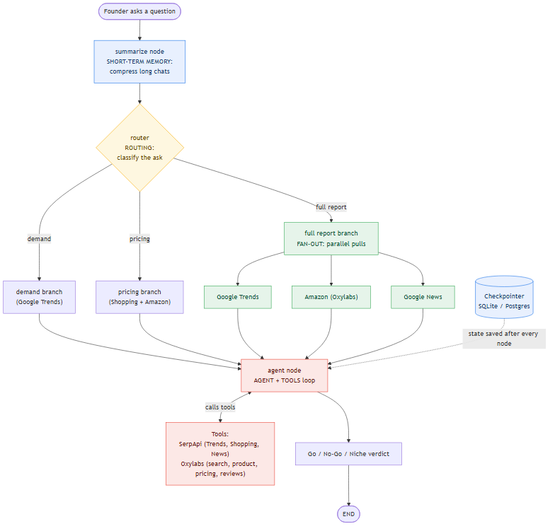

# 🔭 LaunchLens: Enterprise Market Intelligence Agent

LaunchLens is an advanced, production-grade conversational AI analyst built on **LangGraph**. It bridges the gap between consumer demand signals (Google search volume, trends, and news) and marketplace supply reality (Amazon pricing, brand dominance, and customer sentiment) to provide founders with automated, data-driven feasibility analysis.

---

## ⚡ Key Capabilities

* **Demand Trajectory (SerpApi)**: Evaluates query interest over time, identifies breakout queries, and scans google news for competitor events.
* **Supply Mapping (Oxylabs)**: Analyzes best-selling products, pricing spreads, star ratings, and mines customer reviews to extract pain points.
* **Dual-Engine Fusion**: Integrates both data streams into a unified reasoning loop to deliver a structured **Go / No-Go / Niche** verdict.
* **Short-Term Memory & Summarization**: Preserves chat context across multiple turns using persistent database checkpointers, automatically summarizing history past 12 messages.

---

## 🏗️ Architecture & Data Flow

LaunchLens uses a stateful cyclic graph with parallel scanning capabilities and intent-based routing to maximize analysis speed and accuracy.



### Flow Execution Breakdown
1. **Entry Point & Summarization**: Incoming user messages pass through the `Summarize Node` which prunes and condenses the thread if the length exceeds 12 turns.
2. **Intent Classification (Routing)**: An LLM-powered router checks if the prompt requires a new product research scan (`research`) or if it is a follow-up conversation (`chat`).
3. **Parallel Scanning (Fan-Out)**: If a new scan is triggered, the engine fires parallel nodes to query search trends and Amazon listings simultaneously, reducing latencies significantly.
4. **Core Reasoning Loop (Agent & Tools)**: The agent integrates the gathered insights. If it needs deeper details (e.g. review mining for an ASIN), it invokes local tools in a cyclic loop.
5. **Verdict Generation**: A final structured synthesis is generated containing pricing recommendations, risk matrices, and a final market validation score.

---

## ⚡ Quick Start

### Prerequisites
- Python `3.12`
- Node.js `18+` (Optional, for web-based frontend)
- API Credentials:
  - `OPENAI_API_KEY` (Required)
  - `SERP_API_KEY` (Optional; runs in mock mode if omitted)
  - `OXYLABS_USERNAME` & `OXYLABS_PASSWORD` (Optional; runs in mock mode if omitted)

### Option A: Local Execution (Recommended)

1. **Clone & Navigate**
   ```bash
   git clone https://github.com/nithinmanayilghub/LaunchLens-Langgraph-Agent.git
   cd LaunchLens-Langgraph-Agent
   ```

2. **Configure Environment**
   Copy the example environment file and insert your keys (at minimum, `OPENAI_API_KEY`):
   ```bash
   cp .env.example .env
   ```

3. **Install Dependencies**
   LaunchLens uses `uv` for fast python packaging:
   ```bash
   # Install uv if missing
   pip install uv
   
   # Setup virtual env and synchronize lockfile
   uv sync
   ```

4. **Run the Interactive CLI**
   ```bash
   uv run python backend/cli.py chat
   ```

5. **Run the Web App**
   - Start the backend FastAPI server:
     ```bash
     uv run python backend/cli.py serve --port 8010
     ```
   - In a new terminal, boot the React frontend:
     ```bash
     cd frontend
     npm install
     npm run dev
     ```
     Open `http://localhost:5173` in your browser.

---

### Option B: Docker Compose

To spin up the API backend, React frontend, and a PostgreSQL checkpointer database concurrently:

```bash
docker-compose -f docker.yaml up --build
```
- Web UI: `http://localhost:5173`
- API Server: `http://localhost:8010`

---

## 💬 Verification Prompts

You can verify the system workflows using the following scenario steps in either the CLI REPL or Web UI:

1. **Scenario 1: Market Feasibility Scan (Fan-Out & Routing)**
   > **User:** *"I want to launch a stainless-steel insulated water bottle in India under ₹1,500 - is it worth it?"*
   - *Behavior*: Routes to `research` -> Concurrently scrapes Amazon and Google Trends -> Returns pricing analytics, consumer pain points, and a structured **Go/No-Go** verdict.

2. **Scenario 2: Context Preservation & Follow-up**
   > **User:** *"What about the US market? How does the pricing map there?"*
   - *Behavior*: Routes to `chat` -> Retrieves preceding India metrics from memory -> Computes comparative analytics for the US.

3. **Scenario 3: Memory Summarization**
   > Continue chatting past 12 messages.
   - *Behavior*: Automatically compresses older turns to keep the LLM context window clean, keeping key findings in the summary state.

---

## ⚙️ Environment Variables

| Variable Name | Default Value | Purpose |
| :--- | :--- | :--- |
| `OPENAI_API_KEY` | `sk-...` | OpenAI credentials for model invocation. |
| `SERP_API_KEY` | `""` | Key for Google Search trends and shopping (mocked if empty). |
| `OXYLABS_USERNAME` | `""` | Oxylabs E-commerce scraping credentials (mocked if empty). |
| `OXYLABS_PASSWORD` | `""` | Oxylabs credentials password. |
| `SQLITE_DB_PATH` | `checkpoints.sqlite` | Filepath for local SQLite checkpointer. |
| `POSTGRES_URI` | `""` | Connection string for Postgres checkpointer pool. |
